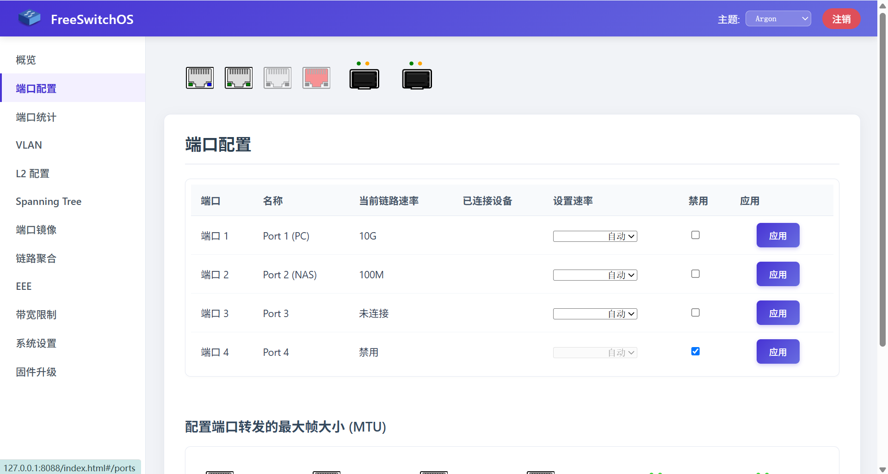

# RTLPlayground with Theme

本项目是基于 Realtek RTL8372/RTL8373 交换机开源固件平台 [RTLPlayground](https://github.com/logicog/RTLPlayground) 的**现代主题与体验增强版**。

在保留官方原生所有网管功能（VLAN、LACP 链路聚合、端口镜像、SFP+ DDM 状态监控、IGMP Snooping、STP 等）的基础上，重构升级了前端交互，引入全新的 **Argon 现代设计主题**，并提供**双主题实时热切换**与**上游源仓库一键补丁工具**。

---

## ✨ 核心特性

- **Argon 现代主题**：暗色渐变顶栏、卡片化布局、精致现代字体、高对比度微磨砂悬浮 Tooltip 气泡与全新登录鉴权界面。
- **双主题无缝切换**：在 Web 顶栏及登录页可随时在 **经典原版 (Default)** 与 **现代主题 (Argon)** 之间秒级切换，偏好配置持久化存储。
- **汉化与交互体验优化**：全面汉化与精简系统设置、升级页和端口指示交互。
- **零硬件本地仿真服务器**：提供基于 Python 的轻量仿真服务（`tools/sim_server.py`），无需刷机编译即可 1:1 本地预览 WebUI。
- **一键补丁工具**：随时随地为官方源仓库或其他派生固件打上主题补丁，并支持一键无损还原。



---

## 🛠️ 一键补丁工具 (Theme Patch Tool)

为了让使用官方上游仓库（`logicog/RTLPlayground`）或其他分支的用户无需手动移植代码，本项目在 `tools/` 目录下提供了全自动的一键补丁系统。

### 工具文件清单

| 文件 | 说明 |
| :--- | :--- |
| `tools/apply_theme_patch.bat` | **Windows 批处理引导**：双击即可自动启动 PowerShell 补丁工具 |
| `tools/apply_theme_patch.ps1` | **核心补丁管理脚本**：支持菜单交互式操作、自动备份与一键还原 |
| `tools/argon_theme.patch` | **Git 标准补丁文件**：针对上游官方最新代码生成的标准 Patch |
| `tools/argon_theme/` | **离线静态资源包**：包含已打包的主题前端文件，免 Git 环境直接应用 |
| `tools/sim_server.py` | **本地仿真测试服务器**：无需交换机硬件即可本地运行调试 Web 界面 |

### 使用方法

#### 方式一：Windows 用户双击运行（推荐）
直接在资源管理器中双击 **`tools/apply_theme_patch.bat`**，按提示输入目标仓库路径（若在本仓库内直接回车即可）。

#### 方式二：PowerShell 终端执行
```powershell
# 交互式运行（自动引导输入目标路径）
pwsh ./tools/apply_theme_patch.ps1

# 或直接在参数中指定目标 RTLPlayground 仓库根目录：
pwsh ./tools/apply_theme_patch.ps1 "D:\develop\RTLPlayground"
```

#### 菜单功能说明：
1. **[推荐] 一键应用 Argon 现代主题**：安全替换 `html/main.js` 和 `html/style.css`，自动将原版文件备份为 `.bak`，支持跨版本及非 Git 目录。
2. **使用 Git Patch 补丁应用**：通过 `git apply` 将 `argon_theme.patch` 打入干净的 Git 分支。
3. **一键还原官方原版**：从 `.bak` 备份或 Git 树快速撤销所有主题改动，恢复为官方原生纯净状态。
4. **启动本地模拟服务器**：一键拉起本地仿真服务器（端口 8088）并自动打开浏览器预览。

#### 方式三：纯 Git 命令行打补丁
在任何标准的 RTLPlayground 仓库根目录下执行：
```bash
git apply tools/argon_theme.patch
```

---

## 🔨 固件编译指南

### 1. 编译环境准备

#### Linux (Debian 12/13 或 Ubuntu 24.04+):
```bash
sudo apt update
sudo apt install make gcc sdcc xxd python-is-python3 libjson-c-dev
```
> **注意**：SDCC 编译器要求版本在 4.5 及以上。

#### Docker 容器化构建（跨平台，无需配置本地依赖）：
```bash
# 构建构建镜像
docker build -t rtlplayground-dev .

# 编译固件（以 DEFAULT_8C_1SFP 为例）
docker run --rm -v $(pwd):/workspace rtlplayground-dev make MACHINE=DEFAULT_8C_1SFP
```

### 2. 硬件与网络预设

- **选择机型**：编辑 `machine.h`，取消注释与您交换机硬件相匹配的型号宏定义（如 `LIANGUO_ZX_SWTGW215AS`、`DEFAULT_8C_1SFP` 等，详见 [支持设备列表](doc/supported_devices.md)）。
- **预设网络参数**：编辑 `config.txt`，设置交换机首次开机默认 IP，避免与主路由冲突：
  ```ini
  ip 192.168.6.100
  gw 192.168.6.1
  netmask 255.255.255.0
  ```

### 3. 执行编译

- **常规直接刷机 / 原生升级包**：
  ```bash
  make
  ```
  产物生成在 `output/rtlplayground_<版本>_<机型>.bin`。

- **原厂 OEM 固件 Web 升级专用包**（仅针对尚未刷入开源固件的原厂管理固件）：
  ```bash
  cd installer
  make
  ```
  产物生成在 `installer/output/rtlplayground_oem_upgrade.bin`。

---

## ⚡ 刷机与升级方式

1. **Web 页面在线升级（软件方式）**：
   - 如果当前已经是 RTLPlayground 固件：在网页的 **固件升级 (Firmware Update)** 页面上传 `output/rtlplayground_*.bin`。
   - 如果当前是原厂 OEM 管理固件：上传 `installer/output/rtlplayground_oem_upgrade.bin`。
2. **SOIC-8 夹子编程器直刷（硬件方式 / 救砖）**：
   - 适用于非网管机型升级、或设备刷砖救援。
   - 断开电源，拆开交换机外壳，使用编程器（如 CH341A / T48 + IMSProg / Flashrom）夹住 Flash 芯片。
   - **务必先完整备份原机 ROM 固件**，清空后写入编译好的 `output/rtlplayground_*.bin`。

---

## 🌐 访问与使用

- **默认后台地址**：编译前在 `config.txt` 中指定的 IP（若未修改，官方默认通常为 `192.168.10.247`）。
- **默认登录密码**：`1234`
- **串口控制台调试**：板载 UART 引脚，波特率 `115200`，`8N1`。

---

## 📖 深入参考文档

- [支持设备硬件型号清单](doc/supported_devices.md)
- [RTL8372/RTL8373 硬件芯片特性](doc/hardware.md)
- [VLAN 配置详解](doc/vlan.md)
- [STP 生成树协议使用规范](doc/stp.md)
- [SFP+ 光口状态与 DDM 信息](doc/sfp.md)
- [链路聚合 (Trunk / LAG)](doc/trunking.md)
- [硬件改装与 Flash 芯片扩容](doc/mods.md)
- [Ghidra 固件逆向分析](doc/ghidra.md)
